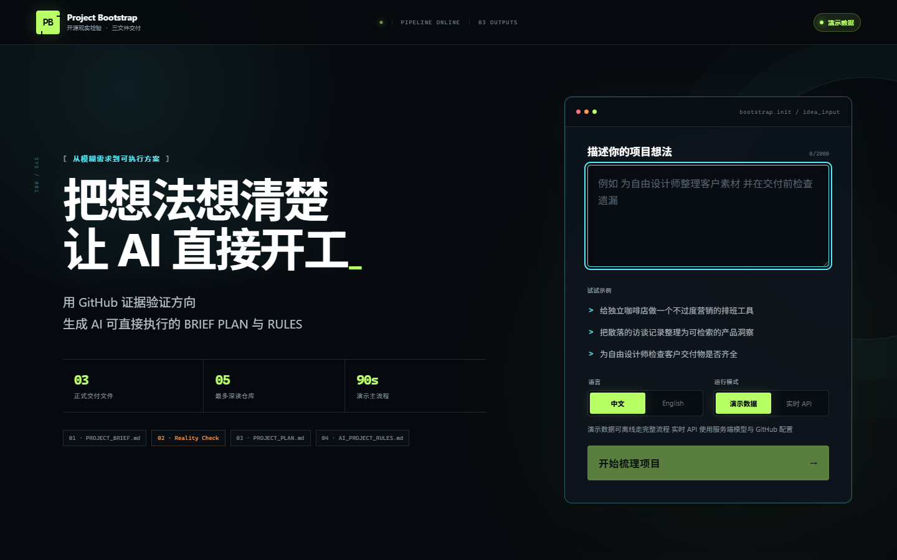

# Project Bootstrap Web

> One idea. One open-source reality check. Three files ready for AI development.

Built on the author's existing open-source [Project Bootstrap core](https://github.com/tianhao8687/project-bootstrap). The core rules predate this competition edition; this repository contains the new interactive web product, server adapters, evidence review, exports, tests, and competition materials.

Project Bootstrap Web helps a non-technical user turn a rough software idea into three separate formal files. If the idea is too vague, it asks one short plain-language clarification round and accepts “I am unsure” as a valid answer with conservative defaults:

- `PROJECT_BRIEF.md` — what to build and why.
- `PROJECT_PLAN.md` — how to build it and how to validate it.
- `AI_PROJECT_RULES.md` — how later AI may act without drifting.

After the BRIEF is explicitly confirmed, an optional GitHub reality check reads repository metadata, README and license evidence. Suggested changes enter formal files only after the user selects and confirms them.

## Current scope

The repository implements the competition MVP: bilingual responsive UI, one-round beginner clarification, safe back navigation with downstream invalidation, explicit reducer state machine, a complete deterministic RAG knowledge-base case, a labeled direct-output comparison, local recovery, OpenAI-compatible bootstrap API, evidence-gated GitHub research API, Markdown preview, copy/download/ZIP export, recoverable errors, unit/integration tests, and desktop/mobile E2E.

It intentionally has no login, database, payment, subscription, team workspace, client-side API keys, multi-model router, automatic code copying, or fourth formal project file.

## Quick start

Requirements: Node.js 20 or newer and pnpm.

```bash
pnpm install
pnpm dev
```

Open `http://127.0.0.1:4173`. **Complete case** starts with the beginner sentence “I want to save my notes and knowledge…” and uses one clarification round to reach a personal-first, team-ready RAG BRIEF, PLAN, RULES, evidence review, and direct-output comparison. It needs no external credentials.

For real `/api` functions, copy `.env.example` to `.env.local`, fill the server-side values, and run through Vercel's local development environment or deploy to Vercel.

```bash
vercel dev
```

Never expose `LLM_API_KEY` or `GITHUB_TOKEN` as `VITE_*` variables.

## Environment

| Variable | Purpose | Required for |
| --- | --- | --- |
| `LLM_BASE_URL` | OpenAI-compatible `/v1` base URL | Live BRIEF/PLAN/RULES and research analysis |
| `LLM_API_KEY` | Server-only model credential | Live model calls |
| `LLM_MODEL` | Provider model identifier | Live model calls |
| `GITHUB_TOKEN` | Server-only GitHub token; optional but strongly recommended | Higher GitHub API limits |
| `APP_MAX_RESEARCH_REPOS` | Repository depth cap; hard maximum remains 5 | Research |
| `APP_REQUEST_TIMEOUT_MS` | Model and GitHub timeout | Live APIs |

## Commands

```bash
pnpm lint          # strict TypeScript check
pnpm test          # unit and integration tests
pnpm build         # production build
pnpm test:e2e      # desktop + 375px Chrome scenarios
pnpm screenshots   # regenerate the seven competition screenshots
pnpm evaluate:real -- --case S1  # run one credentialed comparison case
pnpm smoke:deployment -- https://your-project.vercel.app
pnpm verify-core   # verify the pinned upstream snapshot hashes
pnpm sync-core -- ../project-bootstrap
```

`pnpm sync-core` is intentionally explicit. It reads a local upstream clone, records the exact commit, copies the declared files, and refreshes SHA-256 hashes in `core-source.json`. Review the resulting diff before committing it.

## Architecture

```text
Browser UI
  ├─ explicit reducer state machine + localStorage
  ├─ Markdown preview and three-file exports
  ├─ POST /api/bootstrap ── OpenAI-compatible provider
  └─ POST /api/research  ── GitHub API + evidence-limited model analysis

Pinned core snapshot ───── used by phase-specific server prompts
```

The model supplies structured judgment and content; code owns transitions. BRIEF confirmation gates research, PLAN confirmation gates RULES, and edits invalidate only affected downstream state.

Research treats GitHub README content as untrusted data. The server restricts evidence sources to fetched candidates and rejects repository names or source labels introduced by the model.

## Repository map

```text
api/                    Vercel serverless handlers and adapters
src/app/                locale copy and stage labels
src/components/         shared UI
src/core/generated/     pinned, generated upstream snapshot
src/lib/                API, complete RAG case, and export helpers
src/pages/              Start, workspace, research, and result pages
src/state/              reducer state machine and local recovery
src/types/              Zod schemas and shared TypeScript contracts
scripts/                snapshot, browser evidence, and evaluation runners
tests/                  unit, integration, and browser E2E
docs/                   deployment, evaluation, demo, and state-machine notes
```

See [IMPLEMENTATION_STATUS.md](./IMPLEMENTATION_STATUS.md) for verified commands and remaining external blockers, [COMPETITION_CHANGELOG.md](./COMPETITION_CHANGELOG.md) for timeline disclosure, and [docs/DEMO_SCRIPT.md](./docs/DEMO_SCRIPT.md) for the complete RAG case walkthrough.

## Competition screenshots




Evidence-backed research is captured in [`docs/screenshots/04-research-desktop.png`](./docs/screenshots/04-research-desktop.png), its mobile layout in [`docs/screenshots/05-research-mobile.png`](./docs/screenshots/05-research-mobile.png), the final handoff in [`docs/screenshots/06-result-desktop.png`](./docs/screenshots/06-result-desktop.png), and the expanded direct-output comparison in [`docs/screenshots/07-comparison-desktop.png`](./docs/screenshots/07-comparison-desktop.png).

## Honest limitations

- Live output quality varies by configured OpenAI-compatible model.
- GitHub rate limits are much lower without a server-side token.
- License display is detection plus a general warning, not legal advice.
- No project data is stored server-side in the MVP; browser recovery uses localStorage.
- The included four-repository RAG evidence snapshot is deterministic and clearly labeled. It is not presented as current GitHub data.
